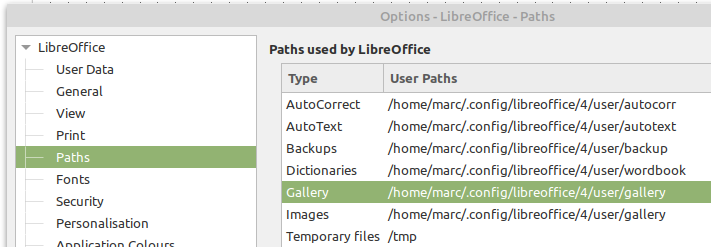
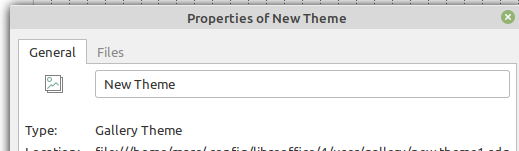
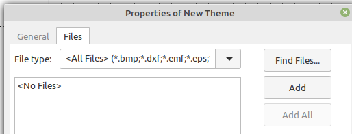
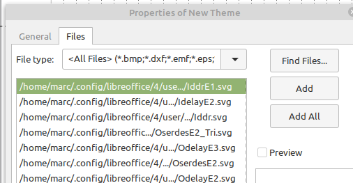
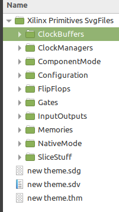

# LibreOffice Draw Xilinx Gallery

Find here a library with Xilinx library primitives that can be used with LibreOffice tools.
The library does not contain all primitives for all Xilinx FPGA families! It contains the primitives I use regularly in technical drawings and presentations. The library, in LibreOffice it’s called a gallery-theme, is created to be used with LibreOffice Draw but it can be used with all LibreOffice office tools.
The intention for creating this gallery is to allow people using LibreOffice tools on Linux or Windows to create Microsoft Office Visio alike drawings.

## Install anew gallery theme

### Linux (Ubuntu/Mint)

1. Once user has used a LibreOffice tool, a set preferences is written in a configuration directory that can be found in the *user* directory: */home/<user>/.config/libreoffice/4/user/...*

3. The directories listed under the */user* directory are:

    ```
    |- autocorr
    |- autotext
    |- backup
    |- basic
    |- config
    |- database
    |- extensions
    |- gallery
    |- pack
    |- psprint
    |- store
    |- uno_packages
    |- wordbook
    ```

    Important directory for new gallery themes is the *gallery* directory.

    Important directory for new gallery themes is the *gallery* directory.

3. Copy the [Xilinx Primitives SvgFiles_<date>.zip](./Xilinx Primitives SvgFiles_04Aug20.zip) file in the *gallery* directory, mentioned in 2, of the LibreOffice installation and unzip it there.

4. Launch LibreOffice Draw.

5. Click the [Tools] tab and select from the drop down menu [Options]

6. In the left pane of the new popped up window select under *LibreOffice* the *Paths* option.

7. The right pane now shows all paths that are necessary when using LibreOffice tools.

9. Look right of *Gallery* to check if the path lists: */home/<user>/.config/libreoffice/4/user/gallery*
  - This figure shows points 6, 7, and 8
      
  - If the correct directory is listed/showed, click [Cancel]
      - If some other directory is listed go to point 4 and copy the three files from the zip file into that directory.
  - OR
      - Create your own gallery directory for the Xilinx primitives library.
      - Copy the zip file created directory and unzip it there.
      - In LibreOffice, [Tools] - [Options] select the *Gallery* line in the right pane.
      - Select the [Edit] button.
      - Click [Add] and browse/select the directory created to host the Xilinx library.
      - Click [OK]
      - Click [OK]
10. In the main LibreOffice Draw top menu, click [View] and in the drop down menu tick [Gallery].
11. In the galleries pane that opens at the right side of the screen slide down, a new **Xilinx Primitives** item could already be listed.
12. If there is no **Xilinx Primitives** selection in the galleries menu, then:
    1. Click [New Theme]
    2. Click the [General] tab on the top of [Properties of New Theme] popup.
      
    3. Replace "New Theme" by "Xilinx Primitives"
    4. Click the [Files] tab on the top of [Properties of New Theme] popup.
    5. Now click: [Find Files].
      
    6. The new popup should display the galleries directory and show the added directory "Xilinx Primitives SvgFiles".
    7. Double click the that directory and click [OK].
    8. In the left pane of the [Properties of New Theme] popup all files of all sub-directories in that added directory should be listed.
    9. Click the [Add All] button.
      
    11. Click [OK]
    12. Now there should be a "Xilinx Primitives" theme in the gallery pane for drawing.
13. From here all Xilinx primitives can be selected and dragged onto a schematic.
14. To be complete the addition of this drawing library do:
    1. Go to: /home/<user>/.config/libreoffice/4/user/gallery
    2. Find there three files: "new theme.sdg", "new theme.sdv" and "new theme.thm".
    3. Rename these files to **Xilinx_primitives.sdg**, .sdv and .thm.
15. Done.

#### REMARK:

- As you will find out, The listing of the component primitives in the gallery theme is not alphabetic!
Below the `/home/<user>/.config/libreoffice/4/user/gallery/Xilinx Primitives SvgFiles` directory sub-directories are listed.
The components listed in the gallery theme are listed as directory groups.


- If another setup is wanted, create for each sub-directory a new theme.
    Like `Xlnx Prim ClockBuffer` and `Xlnx Prim ClockManagers` and ...
    To do that you need for each new theme to follow the above description but then browse and select each sub-directory separately when adding components.
- If you need extra sets of LibreOffice components, not only Xilinx, you can take <a href="mailto:marc.defossez@zirconflex.be?subject=%3C%20Mail%20Subject%20%3E&body=%0AYour%20Name%20:%20%0ACompany%20:%20%0APhone%20:%20%0AEmail%20:%20%0A%0AYour%20message%20goes%20below.%20%0A%0A" >contact</a> and we will see if we can make it a project (possibly charged).

